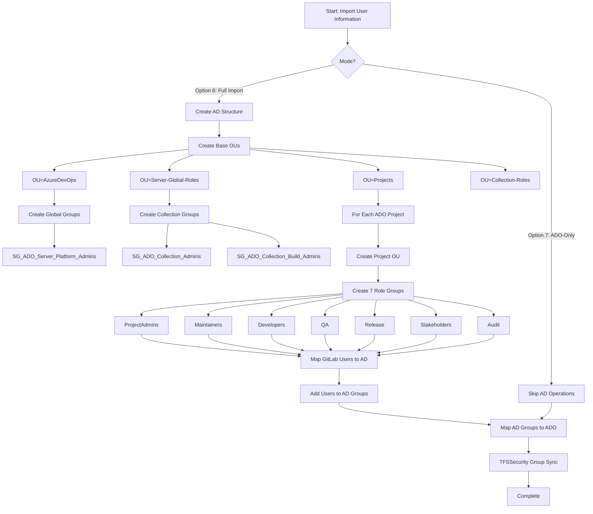

# Active Directory Structure - Mind Map
## Created by Migrate Users Option (Options 6 & 7)

This document visualizes the complete Active Directory organizational structure created during user migration from GitLab to Azure DevOps.

---

## 🌳 Complete AD Hierarchy

```
Domain Root (DC=yourdomain,DC=local)
│
└── OU=AzureDevOps
    │
    ├── OU=Projects ━━━━━━━━━━━━━━━━━━━━━━━━━━━━━━━━━━━━━━┓
    │   │                                                  ║
    │   ├── OU={ProjectKey1} (e.g., OU=PROJECTA)          ║ Per-Project OUs
    │   │   ├── 📁 APP_{ProjectKey}_ProjectAdmins         ║ (One OU per ADO project)
    │   │   ├── 📁 APP_{ProjectKey}_Maintainers           ║
    │   │   ├── 📁 APP_{ProjectKey}_Developers            ║
    │   │   ├── 📁 APP_{ProjectKey}_QA                    ║
    │   │   ├── 📁 APP_{ProjectKey}_Release               ║
    │   │   ├── 📁 APP_{ProjectKey}_Stakeholders          ║
    │   │   └── 📁 APP_{ProjectKey}_Audit                 ║
    │   │                                                  ║
    │   ├── OU={ProjectKey2} (e.g., OU=PROJECTB)          ║
    │   │   ├── 📁 APP_{ProjectKey}_ProjectAdmins         ║
    │   │   ├── 📁 APP_{ProjectKey}_Maintainers           ║
    │   │   ├── 📁 APP_{ProjectKey}_Developers            ║
    │   │   ├── 📁 APP_{ProjectKey}_QA                    ║
    │   │   ├── 📁 APP_{ProjectKey}_Release               ║
    │   │   ├── 📁 APP_{ProjectKey}_Stakeholders          ║
    │   │   └── 📁 APP_{ProjectKey}_Audit                 ║
    │   │                                                  ║
    │   └── OU={ProjectKey...N}                           ║
    │       └── ... (same 7 groups per project)           ┛
    │
    ├── OU=Server-Global-Roles ━━━━━━━━━━━━━━━━━━━━━━━━━━┓
    │   │                                                  ║ Global Server-Level
    │   └── 📁 SG_ADO_Server_Platform_Admins              ║ Administration
    │                                                      ┛
    │
    └── OU=Collection-Roles ━━━━━━━━━━━━━━━━━━━━━━━━━━━━━┓
        │                                                  ║ Collection-Level
        ├── 📁 SG_ADO_Collection_Admins                   ║ Administration
        └── 📁 SG_ADO_Collection_Build_Admins             ║
                                                           ┛
```

---

## 📊 Group Structure Breakdown

### 1️⃣ **Root Organizational Unit**
```
OU=AzureDevOps,DC=yourdomain,DC=local
├── Purpose: Container for all Azure DevOps-related AD objects
├── Created: Always (base OU)
└── Protection: Not protected from accidental deletion
```

### 2️⃣ **Server-Global-Roles OU**
```
OU=Server-Global-Roles,OU=AzureDevOps,DC=yourdomain,DC=local
│
└── Groups Created:
    └── SG_ADO_Server_Platform_Admins
        ├── Scope: Global
        ├── Type: Security
        ├── Purpose: Azure DevOps Server administrators
        └── Maps to: Server-level administrative permissions
```

**Members:** Users who need full server administration rights

**ADO Permissions:**
- Full server configuration access
- Can create/delete collections
- Manage server-wide settings

---

### 3️⃣ **Collection-Roles OU**
```
OU=Collection-Roles,OU=AzureDevOps,DC=yourdomain,DC=local
│
└── Groups Created:
    ├── SG_ADO_Collection_Admins
    │   ├── Scope: Global
    │   ├── Type: Security
    │   ├── Purpose: Collection-level administrators
    │   └── Maps to: Project Collection Administrators
    │
    └── SG_ADO_Collection_Build_Admins
        ├── Scope: Global
        ├── Type: Security
        ├── Purpose: Build infrastructure administrators
        └── Maps to: Collection-level build administration
```

**Members:** Users who manage the collection or build infrastructure

**ADO Permissions:**
- Collection-level settings
- Manage all projects in collection
- Build agent pool management

---

### 4️⃣ **Projects OU**
```
OU=Projects,OU=AzureDevOps,DC=yourdomain,DC=local
│
└── Per-Project Structure (Dynamic - created per ADO project):
    
    OU={ProjectKey},OU=Projects,OU=AzureDevOps,DC=yourdomain,DC=local
    │
    └── Seven Role-Based Groups per Project:
```

#### 🔹 **Project Group Matrix** (7 groups × N projects)

| Group Name Pattern | GitLab Source Roles | ADO Target Groups | Access Level |
|-------------------|---------------------|-------------------|--------------|
| `APP_{ProjectKey}_ProjectAdmins` | Owner | Project Administrators | Full control |
| `APP_{ProjectKey}_Maintainers` | Maintainer | Contributors | Read/Write/Manage branches |
| `APP_{ProjectKey}_Developers` | Developer | Contributors | Read/Write code |
| `APP_{ProjectKey}_QA` | Reporter, Guest | Contributors | Testing/QA access |
| `APP_{ProjectKey}_Release` | (Custom) | Contributors + Build Administrators | Deploy/Release |
| `APP_{ProjectKey}_Stakeholders` | (Custom) | Readers | View-only |
| `APP_{ProjectKey}_Audit` | (Custom) | Readers | Audit/Compliance view |

---

## 🔄 Migration Workflow



---

## 📋 Detailed Group Mappings

### **Global Role Mapping**
```json
{
  "globalRoleGroups": [
    {
      "roleKey": "Platform_Admins",
      "groupName": "SG_ADO_Server_Platform_Admins",
      "ouDn": "OU=Server-Global-Roles,OU=AzureDevOps,DC=yourdomain,DC=local",
      "adoPermissions": "Server Administration"
    }
  ]
}
```

### **Collection Role Mapping**
```json
{
  "collectionRoleGroups": [
    {
      "roleKey": "Collection_Admins",
      "groupName": "SG_ADO_Collection_Admins",
      "ouDn": "OU=Collection-Roles,OU=AzureDevOps,DC=yourdomain,DC=local",
      "adoGroup": "Project Collection Administrators"
    },
    {
      "roleKey": "Collection_Build_Admins",
      "groupName": "SG_ADO_Collection_Build_Admins",
      "ouDn": "OU=Collection-Roles,OU=AzureDevOps,DC=yourdomain,DC=local",
      "adoGroup": "Project Collection Build Administrators"
    }
  ]
}
```

### **Project Role Mapping**
```json
{
  "projectRoleKeys": [
    "ProjectAdmins",    // → [Project Administrators]
    "Maintainers",      // → [Contributors]
    "Developers",       // → [Contributors]
    "QA",               // → [Contributors]
    "Release",          // → [Contributors, Build Administrators]
    "Stakeholders",     // → [Readers]
    "Audit"             // → [Readers]
  ]
}
```

---

## 🎯 Real-World Example

### Scenario: Migrating 3 Projects

**Projects:**
1. **E-Services** (ProjectKey: ESVC)
2. **HR-CRM** (ProjectKey: HRCRM)
3. **Finance** (ProjectKey: FIN)

**GitLab Source:**
- 15 users total
- 3 projects with varying access levels
- Users have Owner, Maintainer, Developer, Reporter roles

### Created Structure:

```
DC=contoso,DC=local
│
└── OU=AzureDevOps
    │
    ├── OU=Server-Global-Roles
    │   └── 📁 SG_ADO_Server_Platform_Admins (2 users)
    │
    ├── OU=Collection-Roles
    │   ├── 📁 SG_ADO_Collection_Admins (3 users)
    │   └── 📁 SG_ADO_Collection_Build_Admins (2 users)
    │
    └── OU=Projects
        ├── OU=ESVC
        │   ├── 📁 APP_ESVC_ProjectAdmins (2 users - from GitLab Owners)
        │   ├── 📁 APP_ESVC_Maintainers (3 users - from GitLab Maintainers)
        │   ├── 📁 APP_ESVC_Developers (5 users - from GitLab Developers)
        │   ├── 📁 APP_ESVC_QA (2 users - from GitLab Reporters)
        │   ├── 📁 APP_ESVC_Release (1 user)
        │   ├── 📁 APP_ESVC_Stakeholders (3 users)
        │   └── 📁 APP_ESVC_Audit (1 user)
        │
        ├── OU=HRCRM
        │   ├── 📁 APP_HRCRM_ProjectAdmins (1 user)
        │   ├── 📁 APP_HRCRM_Maintainers (2 users)
        │   ├── 📁 APP_HRCRM_Developers (4 users)
        │   ├── 📁 APP_HRCRM_QA (1 user)
        │   ├── 📁 APP_HRCRM_Release (1 user)
        │   ├── 📁 APP_HRCRM_Stakeholders (2 users)
        │   └── 📁 APP_HRCRM_Audit (1 user)
        │
        └── OU=FIN
            ├── 📁 APP_FIN_ProjectAdmins (2 users)
            ├── 📁 APP_FIN_Maintainers (2 users)
            ├── 📁 APP_FIN_Developers (3 users)
            ├── 📁 APP_FIN_QA (2 users)
            ├── 📁 APP_FIN_Release (1 user)
            ├── 📁 APP_FIN_Stakeholders (4 users)
            └── 📁 APP_FIN_Audit (2 users)
```

**Total Objects Created:**
- **OUs:** 6 (base: 4, per-project: 3)
- **Groups:** 24 (global: 1, collection: 2, project: 7×3)
- **User Memberships:** 45 (varies by role distribution)

---

## 🔐 Security & Permissions Flow

### **Identity Resolution Chain**

```
GitLab User → Identity Candidates → AD User Lookup → Group Membership
     │              │                      │                │
     │              │                      │                └─→ Add to role group
     │              │                      │
     │              │                      └─→ Resolve by:
     │              │                          1. userPrincipalName
     │              │                          2. samAccountName
     │              │                          3. mail
     │              │
     │              └─→ Sources:
     │                  - Manual overrides (config)
     │                  - GitLab email
     │                  - GitLab username
     │
     └─→ GitLab Export Data:
         - username
         - email
         - access_level (Owner/Maintainer/Developer/Reporter)
```

### **Group → ADO Sync Process**

```
AD Security Group → TFSSecurity.exe → Azure DevOps Group
       │                   │                    │
       │                   │                    └─→ Native ADO group
       │                   │                        (Contributors, Readers, etc.)
       │                   │
       │                   └─→ Command:
       │                       /a+ [Group] "n:DOMAIN\GroupName"
       │
       └─→ Format: APP_{ProjectKey}_{RoleKey}
```

---

## 📌 Key Configuration Points

### **Naming Conventions**
```json
{
  "groupNaming": {
    "projectGroupNameFormat": "APP_{ProjectKey}_{RoleKey}",
    "globalGroupNameFormat": "SG_ADO_Server_{RoleKey}",
    "collectionGroupNameFormat": "SG_ADO_Collection_{RoleKey}"
  }
}
```

### **OU Templates**
```json
{
  "projectOuTemplate": "OU={ProjectKey},OU=Projects,OU=AzureDevOps,DC=yourdomain,DC=local"
}
```

### **Role Keys (Standard)**
```javascript
[
  "ProjectAdmins",   // Full project control
  "Maintainers",     // Code + branch management
  "Developers",      // Code contribution
  "QA",              // Testing/quality
  "Release",         // Deployment/build
  "Stakeholders",    // View-only business users
  "Audit"            // Compliance/audit access
]
```

---

## 🚀 Operation Modes

### **Option 6: Full Import (Import User Information)**
✅ Creates AD OUs  
✅ Creates AD Groups  
✅ Adds users to AD groups  
✅ Maps AD groups to Azure DevOps  

**Requires:**
- Domain membership
- AD PowerShell module
- Appropriate AD permissions
- GitLab export files (users.json, project-memberships.json)

### **Option 7: ADO-Only Import**
❌ Skips AD OU creation  
❌ Skips AD Group creation  
❌ Skips user membership changes  
✅ Maps existing AD groups to Azure DevOps  

**Requires:**
- Existing AD groups (pre-created)
- Azure DevOps permissions
- TFSSecurity.exe access

---

## 📁 Input Files Required

```
exports/
├── users.json                    # GitLab user list
├── project-memberships.json      # GitLab project access
└── projects.json                 # ADO project mappings

config-ado-ad.json                # AD configuration
```

---

## 🛡️ Safety Features

1. **Dry-Run Mode**: Preview all changes without executing
2. **Idempotency**: Safe to re-run (skips existing objects)
3. **Domain Validation**: Checks domain membership before execution
4. **Input Validation**: Validates DN format and role mappings
5. **Error Reporting**: Comprehensive logging and missing user tracking
6. **Protected Deletion**: OUs not protected (allows cleanup)

---

## 📈 Scalability

| Projects | OUs | Groups | Typical Runtime |
|----------|-----|--------|----------------|
| 1        | 5   | 10     | 2-5 minutes    |
| 10       | 14  | 73     | 10-15 minutes  |
| 50       | 54  | 353    | 45-60 minutes  |
| 100      | 104 | 703    | 90-120 minutes |

**Runtime factors:**
- AD replication latency
- Number of users per group
- Network speed to domain controller
- TFSSecurity.exe execution time

---

## 🔍 Verification Queries

### Check Created OUs
```powershell
Get-ADOrganizationalUnit -Filter * -SearchBase "OU=AzureDevOps,DC=yourdomain,DC=local" | 
    Select-Object Name, DistinguishedName | 
    Sort-Object DistinguishedName
```

### Check Created Groups
```powershell
Get-ADGroup -Filter * -SearchBase "OU=AzureDevOps,DC=yourdomain,DC=local" | 
    Select-Object Name, GroupScope, GroupCategory | 
    Sort-Object Name
```

### Check Group Membership
```powershell
$groupName = "APP_PROJECTA_Developers"
Get-ADGroupMember -Identity $groupName | 
    Select-Object Name, SamAccountName, ObjectClass
```

### Verify ADO Mapping
```powershell
# Via TFSSecurity
tfssecurity /g+ "[ProjectName]\Contributors" "n:DOMAIN\APP_PROJECTA_Developers"
```

---

## 🔗 Azure DevOps Group Mapping Tables

### **Table 1: AD Group to ADO Built-in Group Mapping (Project Level)**

This table shows how Active Directory security groups are mapped to Azure DevOps native groups using TFSSecurity.

| AD Group Pattern | ADO Built-in Group | Scope | Permissions Summary | TFSSecurity Command |
|-----------------|-------------------|-------|---------------------|---------------------|
| `APP_{ProjectKey}_ProjectAdmins` | **Project Administrators** | Project | Full project control, settings, security | `/g+ "[Project]\Project Administrators" "n:DOMAIN\APP_{ProjectKey}_ProjectAdmins"` |
| `APP_{ProjectKey}_Maintainers` | **Contributors** | Project | Read, write, create branches, manage PRs | `/g+ "[Project]\Contributors" "n:DOMAIN\APP_{ProjectKey}_Maintainers"` |
| `APP_{ProjectKey}_Developers` | **Contributors** | Project | Read, write, create branches, manage PRs | `/g+ "[Project]\Contributors" "n:DOMAIN\APP_{ProjectKey}_Developers"` |
| `APP_{ProjectKey}_QA` | **Contributors** | Project | Read, write, create branches, manage PRs | `/g+ "[Project]\Contributors" "n:DOMAIN\APP_{ProjectKey}_QA"` |
| `APP_{ProjectKey}_Release` | **Contributors** + **Build Administrators** | Project | Contribute + manage pipelines/builds | `/g+ "[Project]\Contributors" "n:DOMAIN\APP_{ProjectKey}_Release"` <br> `/g+ "[Project]\Build Administrators" "n:DOMAIN\APP_{ProjectKey}_Release"` |
| `APP_{ProjectKey}_Stakeholders` | **Readers** | Project | View-only access (code, work items, boards) | `/g+ "[Project]\Readers" "n:DOMAIN\APP_{ProjectKey}_Stakeholders"` |
| `APP_{ProjectKey}_Audit` | **Readers** | Project | View-only access for compliance/audit | `/g+ "[Project]\Readers" "n:DOMAIN\APP_{ProjectKey}_Audit"` |
| `SG_ADO_Collection_Admins` | **Project Collection Administrators** | Collection | Full collection control, manage all projects | `/g+ "[TEAM FOUNDATION]\Project Collection Administrators" "n:DOMAIN\SG_ADO_Collection_Admins"` |
| `SG_ADO_Collection_Build_Admins` | **Project Collection Build Administrators** | Collection | Manage build infrastructure, agent pools | `/g+ "[TEAM FOUNDATION]\Project Collection Build Administrators" "n:DOMAIN\SG_ADO_Collection_Build_Admins"` |

**Notes:**
- Multiple AD groups can map to the same ADO group (e.g., Maintainers, Developers, QA → Contributors)
- Release group gets dual membership (Contributors + Build Administrators)
- TFSSecurity format: `/g+ "ADO_GROUP_IDENTITY" "n:DOMAIN\AD_GROUP_SAM"`
- Domain is converted to NetBIOS format (e.g., `contoso.local` → `CONTOSO`)

---

### **Table 2: Azure DevOps Built-in Groups & Permissions**

Complete reference of ADO native groups and their capabilities.

| ADO Group Name | Level | Key Permissions | Use Cases | Default Members |
|---------------|-------|-----------------|-----------|-----------------|
| **Project Collection Administrators** | Collection | • Full server access<br>• Create/delete projects<br>• Manage collections<br>• Configure server settings<br>• Manage all security | • Platform administrators<br>• DevOps leadership<br>• Infrastructure team | Server administrators |
| **Project Collection Build Administrators** | Collection | • Manage build resources<br>• Configure agent pools<br>• Manage pipeline infrastructure<br>• View all projects | • CI/CD administrators<br>• Build infrastructure team<br>• DevOps engineers | Collection admins |
| **Project Administrators** | Project | • Full project control<br>• Manage security/permissions<br>• Create/delete repos<br>• Configure project settings<br>• Manage teams | • Project leads<br>• Team managers<br>• Project owners | Project creator |
| **Contributors** | Project | • Read/write code<br>• Create branches<br>• Create/manage PRs<br>• Create/edit work items<br>• Run pipelines | • Developers<br>• Maintainers<br>• QA engineers<br>• Technical contributors | None (must be added) |
| **Build Administrators** | Project | • Manage build pipelines<br>• Configure build definitions<br>• Manage build queues<br>• Override build policies | • Release managers<br>• DevOps engineers<br>• CI/CD specialists | Project admins |
| **Readers** | Project | • View-only code<br>• View work items<br>• View boards<br>• View test plans<br>• Cannot create/edit | • Stakeholders<br>• Business analysts<br>• Auditors<br>• Management | None (must be added) |
| **Project Valid Users** | Project | • Basic access<br>• Inherited by all users | • Automatic membership<br>• All authenticated users | All project members (automatic) |
| **Release Administrators** | Project | • Manage release pipelines<br>• Configure deployments<br>• Approve releases | • Release managers<br>• Deployment engineers | Project admins |
| **Endpoint Administrators** | Project | • Manage service connections<br>• Configure external endpoints | • DevOps engineers<br>• Integration specialists | Project admins |

---

### **Table 3: GitLab Role to Normalized Role Mapping**

How GitLab access levels are translated to custom role keys.

| GitLab Role | Access Level | Normalized Role Key | Target AD Group(s) | Target ADO Group | Notes |
|------------|--------------|--------------------|--------------------|------------------|-------|
| **Owner** | 50 | `ProjectAdmins` | `APP_{ProjectKey}_ProjectAdmins` | Project Administrators | Full project control |
| **Maintainer** | 40 | `Maintainers` | `APP_{ProjectKey}_Maintainers` | Contributors | Can manage branches, approve PRs |
| **Developer** | 30 | `Developers` | `APP_{ProjectKey}_Developers` | Contributors | Standard development access |
| **Reporter** | 20 | `QA` | `APP_{ProjectKey}_QA` | Contributors | Testing and quality assurance |
| **Guest** | 10 | `QA` | `APP_{ProjectKey}_QA` | Contributors | Limited access, often for external QA |
| *(Custom)* | - | `Release` | `APP_{ProjectKey}_Release` | Contributors + Build Administrators | Deploy and release management |
| *(Custom)* | - | `Stakeholders` | `APP_{ProjectKey}_Stakeholders` | Readers | Business users, view-only |
| *(Custom)* | - | `Audit` | `APP_{ProjectKey}_Audit` | Readers | Compliance and audit access |

**Configuration Snippet:**
```json
{
  "roleMapping": {
    "sourceSystem": "GitLab",
    "sourceRolesToNormalizedRoles": [
      { "sourceRoles": ["Owner"], "normalizedRole": "ProjectAdmins" },
      { "sourceRoles": ["Maintainer"], "normalizedRole": "Maintainers" },
      { "sourceRoles": ["Developer"], "normalizedRole": "Developers" },
      { "sourceRoles": ["Reporter", "Guest"], "normalizedRole": "QA" }
    ]
  }
}
```

---

### **Table 4: Permission Matrix by Role**

Detailed permission breakdown for each normalized role.

| Permission Area | ProjectAdmins | Maintainers | Developers | QA | Release | Stakeholders | Audit |
|----------------|--------------|-------------|------------|----|---------|--------------| ------|
| **Repository Access** ||||||||
| Clone repository | ✅ | ✅ | ✅ | ✅ | ✅ | ✅ | ✅ |
| View code | ✅ | ✅ | ✅ | ✅ | ✅ | ✅ | ✅ |
| Create branch | ✅ | ✅ | ✅ | ✅ | ✅ | ❌ | ❌ |
| Push commits | ✅ | ✅ | ✅ | ✅ | ✅ | ❌ | ❌ |
| Create PR | ✅ | ✅ | ✅ | ✅ | ✅ | ❌ | ❌ |
| Approve PR | ✅ | ✅ | ✅ | ✅ | ✅ | ❌ | ❌ |
| Force push | ✅ | ⚠️ | ❌ | ❌ | ⚠️ | ❌ | ❌ |
| Delete branch | ✅ | ✅ | ❌ | ❌ | ⚠️ | ❌ | ❌ |
| Manage policies | ✅ | ❌ | ❌ | ❌ | ❌ | ❌ | ❌ |
| **Work Items** ||||||||
| View work items | ✅ | ✅ | ✅ | ✅ | ✅ | ✅ | ✅ |
| Create work items | ✅ | ✅ | ✅ | ✅ | ✅ | ❌ | ❌ |
| Edit work items | ✅ | ✅ | ✅ | ✅ | ✅ | ❌ | ❌ |
| Delete work items | ✅ | ⚠️ | ❌ | ❌ | ❌ | ❌ | ❌ |
| Move work items | ✅ | ✅ | ✅ | ✅ | ✅ | ❌ | ❌ |
| **Pipelines** ||||||||
| View pipelines | ✅ | ✅ | ✅ | ✅ | ✅ | ✅ | ✅ |
| Run pipelines | ✅ | ✅ | ✅ | ✅ | ✅ | ❌ | ❌ |
| Edit pipelines | ✅ | ⚠️ | ❌ | ❌ | ✅ | ❌ | ❌ |
| Delete pipelines | ✅ | ❌ | ❌ | ❌ | ✅ | ❌ | ❌ |
| Manage build queues | ✅ | ❌ | ❌ | ❌ | ✅ | ❌ | ❌ |
| Approve deployments | ✅ | ⚠️ | ❌ | ❌ | ✅ | ❌ | ❌ |
| **Project Settings** ||||||||
| View settings | ✅ | ✅ | ✅ | ✅ | ✅ | ⚠️ | ⚠️ |
| Edit settings | ✅ | ❌ | ❌ | ❌ | ❌ | ❌ | ❌ |
| Manage security | ✅ | ❌ | ❌ | ❌ | ❌ | ❌ | ❌ |
| Create teams | ✅ | ❌ | ❌ | ❌ | ❌ | ❌ | ❌ |
| Delete project | ✅ | ❌ | ❌ | ❌ | ❌ | ❌ | ❌ |
| **Boards & Planning** ||||||||
| View boards | ✅ | ✅ | ✅ | ✅ | ✅ | ✅ | ✅ |
| Edit boards | ✅ | ✅ | ✅ | ✅ | ✅ | ❌ | ❌ |
| Manage sprints | ✅ | ✅ | ⚠️ | ⚠️ | ⚠️ | ❌ | ❌ |
| Manage backlogs | ✅ | ✅ | ✅ | ✅ | ✅ | ❌ | ❌ |
| **Testing** ||||||||
| View test plans | ✅ | ✅ | ✅ | ✅ | ✅ | ✅ | ✅ |
| Create test plans | ✅ | ✅ | ⚠️ | ✅ | ⚠️ | ❌ | ❌ |
| Execute tests | ✅ | ✅ | ✅ | ✅ | ✅ | ❌ | ❌ |
| Manage test configs | ✅ | ✅ | ❌ | ✅ | ❌ | ❌ | ❌ |

**Legend:**
- ✅ **Allowed** - Full permission granted
- ❌ **Denied** - No access
- ⚠️ **Limited** - Restricted or requires approval

---

### **Table 5: TFSSecurity Command Reference**

Common TFSSecurity commands for group management.

| Operation | Command | Example |
|-----------|---------|---------|
| **Add AD group to ADO project group** | `/g+ "[Project]\ADOGroup" "n:DOMAIN\ADGroupSam"` | `tfssecurity /g+ "[MyProject]\Contributors" "n:CONTOSO\APP_MYPROJECT_Developers" /collection:http://server:8080/tfs/DefaultCollection` |
| **Remove AD group from ADO group** | `/g- "[Project]\ADOGroup" "n:DOMAIN\ADGroupSam"` | `tfssecurity /g- "[MyProject]\Contributors" "n:CONTOSO\APP_MYPROJECT_Developers" /collection:http://server:8080/tfs/DefaultCollection` |
| **List members of ADO group** | `/g "[Project]\ADOGroup"` | `tfssecurity /g "[MyProject]\Contributors" /collection:http://server:8080/tfs/DefaultCollection` |
| **Add user to ADO group** | `/g+ "[Project]\ADOGroup" "DOMAIN\username"` | `tfssecurity /g+ "[MyProject]\Readers" "CONTOSO\john.doe" /collection:http://server:8080/tfs/DefaultCollection` |
| **Add collection-level group** | `/g+ "[TEAM FOUNDATION]\ADOGroup" "n:DOMAIN\ADGroupSam"` | `tfssecurity /g+ "[TEAM FOUNDATION]\Project Collection Administrators" "n:CONTOSO\SG_ADO_Collection_Admins" /collection:http://server:8080/tfs/DefaultCollection` |
| **Create custom ADO group** | `/gcr "[Project]\CustomGroup" "Description"` | `tfssecurity /gcr "[MyProject]\External Contractors" "Third-party developers" /collection:http://server:8080/tfs/DefaultCollection` |

**Notes:**
- `n:` prefix indicates an AD security group (not individual user)
- Domain must be NetBIOS format (e.g., `CONTOSO`, not `contoso.local`)
- Collection URL is mandatory for all operations
- Exit code `0` = success, non-zero = failure

---

### **Table 6: Group Mapping Configuration Examples**

Real-world configuration patterns for different scenarios.

#### **Scenario A: Standard Mapping (Default)**
```json
{
  "defaultAdoGroupMappings": {
    "ProjectAdmins": ["Project Administrators"],
    "Maintainers": ["Contributors"],
    "Developers": ["Contributors"],
    "QA": ["Contributors"],
    "Release": ["Contributors", "Build Administrators"],
    "Stakeholders": ["Readers"],
    "Audit": ["Readers"]
  }
}
```

#### **Scenario B: Strict Separation (QA has read-only repo)**
```json
{
  "defaultAdoGroupMappings": {
    "ProjectAdmins": ["Project Administrators"],
    "Maintainers": ["Contributors"],
    "Developers": ["Contributors"],
    "QA": ["Readers"],
    "Release": ["Build Administrators"],
    "Stakeholders": ["Readers"],
    "Audit": ["Readers"]
  }
}
```

#### **Scenario C: Per-Project Override**
```json
{
  "explicitProjects": [
    {
      "adoProjectKey": "CRITICAL_PROJECT",
      "adoProjectName": "CriticalApp",
      "overrideAdoGroupMappings": {
        "ProjectAdmins": ["Project Administrators"],
        "Maintainers": ["Contributors"],
        "Developers": ["Readers"],
        "QA": ["Readers"],
        "Release": ["Project Administrators"],
        "Stakeholders": ["Readers"],
        "Audit": ["Readers"]
      }
    }
  ]
}
```

---

### **Table 7: Verification Checklist**

Post-migration validation commands and expected results.

| Check | Command / Action | Expected Result |
|-------|-----------------|-----------------|
| **AD Group Exists** | `Get-ADGroup -Identity "APP_PROJECTA_Developers"` | Group object returned |
| **AD Group Members** | `Get-ADGroupMember -Identity "APP_PROJECTA_Developers"` | List of user objects |
| **ADO Group Exists** | Navigate to Project Settings → Permissions | Group visible in UI |
| **ADO Group Contains AD Group** | `tfssecurity /g "[Project]\Contributors" /collection:URL` | AD group listed as member |
| **User Can Access** | User logs in and navigates to project | Access granted |
| **User Cannot Push** (Readers) | User attempts `git push` | Access denied error |
| **Pipeline Can Run** (Release group) | Trigger pipeline manually | Pipeline executes |
| **Build Definition Editable** (Build Admins) | Edit pipeline YAML | Save successful |
| **Work Item Creatable** (Contributors) | Create new user story | Work item created |
| **Project Settings Visible** (Admins only) | Navigate to Project Settings | Settings accessible |

---

## 📖 Related Documentation

- [User Export/Import Guide](USER_EXPORT_IMPORT.md)
- [Configuration Reference](env-configuration.md)
- [CLI Usage](cli-usage.md)
- [Best Practices](BEST_PRACTICES_ALIGNMENT.md)
- [TFSSecurity Documentation](https://learn.microsoft.com/en-us/azure/devops/server/command-line/tfssecurity-cmd)

---

## 🏁 Summary

The **Migrate Users** option creates a comprehensive, hierarchical Active Directory structure that mirrors Azure DevOps security requirements:

- **4 Base OUs**: Root container + 3 functional containers
- **N Project OUs**: One per Azure DevOps project
- **1 Global Group**: Server administration
- **2 Collection Groups**: Collection-level management
- **7N Project Groups**: Seven role-based groups per project

This structure provides:
- Clear separation of concerns
- Role-based access control (RBAC)
- Scalable multi-project support
- Auditable security model
- Integration with Azure DevOps native groups

All operations are idempotent, logged, and support dry-run validation before execution.
