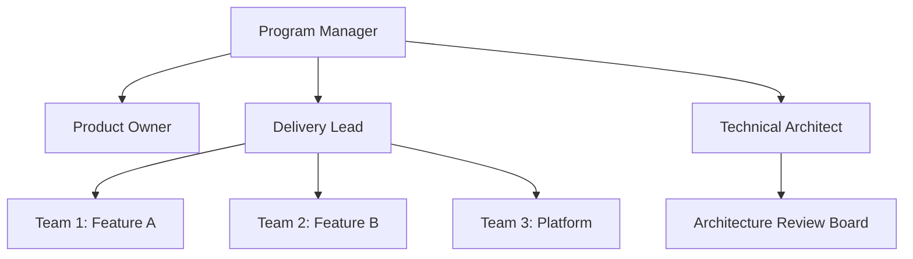

# Program Overview

## Executive Summary

This page provides a high-level overview of the program, its objectives, scope, and organizational structure. Use this as the central hub for program-level information.

---

## Program Mission & Vision

### Mission Statement
_Replace with your program's mission - why does this program exist?_

### Vision Statement
_Replace with your program's vision - what success looks like in 3-5 years_

---

## Program Objectives

### Primary Objectives
1. **Objective 1**: Description and success criteria
2. **Objective 2**: Description and success criteria
3. **Objective 3**: Description and success criteria

### Key Results (OKRs)
| Objective | Key Result | Target | Current | Status |
|-----------|------------|--------|---------|--------|
| Example | Improve delivery speed | 50% reduction | 20% | 🟡 On Track |
| Example | Increase quality | < 5 P1 bugs/sprint | 8 | 🔴 At Risk |
| Example | Team satisfaction | > 8.0 score | 7.5 | 🟡 On Track |

---

## Program Scope

### In Scope
- Feature/capability 1
- Feature/capability 2
- Feature/capability 3

### Out of Scope
- Explicitly excluded items
- Future considerations
- Dependencies managed elsewhere

### Boundaries & Constraints
- **Budget**: $X million over Y years
- **Timeline**: Start date to end date
- **Resources**: X teams, Y FTEs
- **Technology**: Approved tech stack

---

## Organizational Structure

### Program Leadership

#### Program Manager
**Name**: [Your Name]  
**Email**: [email@example.com]  
**Responsibilities**: Overall program delivery, stakeholder management, budget oversight

#### Product Owner
**Name**: [Name]  
**Email**: [email@example.com]  
**Responsibilities**: Product strategy, backlog prioritization, business value

#### Delivery Lead
**Name**: [Name]  
**Email**: [email@example.com]  
**Responsibilities**: Agile delivery, team coordination, velocity optimization

#### Technical Architect
**Name**: [Name]  
**Email**: [email@example.com]  
**Responsibilities**: Technical strategy, architecture decisions, technology standards

---

### Team Structure

#### Development Teams
| Team Name | Focus Area | Team Lead | Members |
|-----------|------------|-----------|---------|
| Team Alpha | Frontend & UX | [Name] | 8 |
| Team Beta | Backend Services | [Name] | 7 |
| Team Gamma | Platform & DevOps | [Name] | 5 |
| Team Delta | Data & Analytics | [Name] | 6 |

---

## Governance Model

### Decision-Making Framework
- **Strategic decisions**: Program Steering Committee (monthly)
- **Tactical decisions**: Program Leadership Team (weekly)
- **Technical decisions**: Architecture Review Board (bi-weekly)
- **Team-level decisions**: Agile teams (daily/sprint ceremonies)

### Escalation Path
1. **Team Level**: Team Lead → Delivery Lead (0-2 days)
2. **Program Level**: Delivery Lead → Program Manager (2-5 days)
3. **Executive Level**: Program Manager → Steering Committee (5-10 days)

### Change Control
- **Minor changes**: Team Lead approval
- **Medium changes**: Program Manager approval + impact assessment
- **Major changes**: Steering Committee approval + business case

---

## Communication Plan

### Regular Touchpoints
| Meeting | Frequency | Attendees | Purpose |
|---------|-----------|-----------|---------|
| Steering Committee | Monthly | Executives, PM, PO | Strategic direction |
| Program Sync | Weekly | Leadership team | Status, blockers |
| Demo Day | Bi-weekly | All teams + stakeholders | Show progress |
| Team Retrospectives | End of sprint | Individual teams | Continuous improvement |
| All-Hands | Monthly | Entire program | Alignment, celebration |

### Communication Channels
- **Urgent issues**: Phone/Teams call
- **Daily coordination**: Teams channels
- **Status updates**: Email + wiki updates
- **Documentation**: Azure DevOps wiki (this!)

---

## Success Metrics & KPIs

### Program Health Dashboard
View real-time metrics: [Link to Dashboard](#)

### Primary KPIs
1. **Schedule Performance Index (SPI)**: Target > 0.95
2. **Cost Performance Index (CPI)**: Target > 0.95
3. **Quality Metrics**: Defect density, test coverage
4. **Team Velocity**: Story points per sprint
5. **Customer Satisfaction**: NPS or CSAT score

### Reporting Schedule
- **Weekly**: Status report to leadership
- **Monthly**: Executive dashboard to steering committee
- **Quarterly**: Business review with detailed metrics

---

## Risk Management

### Top 5 Program Risks
| Risk | Impact | Probability | Mitigation | Owner |
|------|--------|-------------|------------|-------|
| Example: Key resource departure | High | Medium | Cross-training, documentation | PM |
| Example: Technology dependency | Medium | High | Alternative vendors identified | Architect |

_See [Risks & Issues](/Risks-Issues) for complete RAID log_

---

## Dependencies

### External Dependencies
- **Vendor X**: API access (expected: Q2)
- **Platform Y**: Infrastructure provisioning (expected: Q1)
- **Team Z**: Shared services (ongoing)

### Internal Dependencies
- **Data Migration**: Must complete before feature releases
- **Security Review**: Gating factor for production deployment

---

## Key Milestones

### Major Milestones
| Milestone | Target Date | Status | Notes |
|-----------|-------------|--------|-------|
| Program Kickoff | 2025-01-15 | ✅ Complete | All teams onboarded |
| MVP Release | 2025-06-30 | 🟡 On Track | 80% features complete |
| Beta Launch | 2025-09-15 | 🔵 Planned | Pending UX validation |
| GA Release | 2025-12-01 | 🔵 Planned | Full production rollout |

### Sprint Milestones
View current sprint progress: [Sprint Planning](/Sprint-Planning)

---

## Program Artifacts

### Key Documents
- 📊 [Program Charter](link-to-document)
- 🗺️ [Product Roadmap](/Roadmap)
- 📅 [Sprint Planning](/Sprint-Planning)
- 👥 [Capacity Planning](/Capacity-Planning)
- 🎯 [RAID Log](/Risks-Issues)
- 📈 [Metrics Dashboard](/Metrics-Dashboard)
- 🔄 [Retrospective Insights](/Retrospectives)

### Code Repositories
- **Frontend**: [Link to repo]
- **Backend**: [Link to repo]
- **Infrastructure**: [Link to repo]

### External Resources
- **Confluence/SharePoint**: [Link]
- **Jira/Project Management**: [Link]
- **Design System**: [Link]

---

## Onboarding for New Team Members

### First Day Checklist
- [ ] Access to Azure DevOps granted
- [ ] Added to Teams channels
- [ ] Workstation/tools setup complete
- [ ] Read program overview (this page!)
- [ ] Meet with team lead

### First Week Checklist
- [ ] Review architecture documentation
- [ ] Complete security training
- [ ] Attend daily standup
- [ ] Shadow experienced team member
- [ ] Make first small contribution

### Resources
- 📚 [Training & Quick Start](/Training-Quick-Start)
- 💬 [Communication Guidelines](/Communication-Templates)
- 📖 [Ways of Working](/Ways-of-Working)
- 🔤 [Glossary](/Glossary)

---

## Contact Information

### Program Management Office (PMO)
- **Email**: pmo@example.com
- **Teams Channel**: [PMO Channel]
- **Office Hours**: Monday-Friday, 9:00-17:00 EST

### Support Channels
- **Technical Issues**: [DevOps Team Channel]
- **Process Questions**: [PMO Channel]
- **HR/Admin**: [HR Contact]

---

## Version History

| Version | Date | Author | Changes |
|---------|------|--------|---------|
| 1.0 | 2025-01-15 | [Your Name] | Initial program overview |
| 1.1 | 2025-02-01 | [Your Name] | Updated team structure |

---

## 📚 References

### Program Management
- [PMI Program Management Standard](https://www.pmi.org/pmbok-guide-standards/framework/program-management)
- [Microsoft Program Management Guide](https://learn.microsoft.com/en-us/azure/devops/boards/plans/)
- [SAFe Program Management](https://scaledagileframework.com/program-and-solution-management/)

### Azure DevOps Resources
- [Azure Boards Overview](https://learn.microsoft.com/en-us/azure/devops/boards/get-started/)
- [Portfolio Planning](https://learn.microsoft.com/en-us/azure/devops/boards/plans/portfolio-management)
- [Dashboards & Reports](https://learn.microsoft.com/en-us/azure/devops/report/dashboards/)

### Best Practices
- [Agile at Scale Best Practices](https://www.atlassian.com/agile/agile-at-scale)
- [Program Governance Models](https://www.pmi.org/learning/library/effective-governance-program-management-6496)
