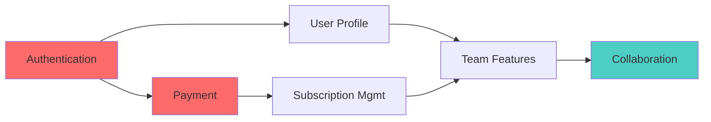

# Product Roadmap

## Vision & Strategy

### Product Vision
_Where are we going? What problem are we solving?_

Our product vision is to create [describe the ultimate goal and value proposition]. Over the next 12-18 months, we will transform how [target users] accomplish [key outcomes].

### Strategic Themes
1. **🎯 Theme 1: Customer Experience**
   - Simplify user workflows
   - Reduce time-to-value by 50%
   - Achieve NPS > 50

2. **⚡ Theme 2: Performance & Scale**
   - Support 10x user growth
   - Reduce latency to < 200ms
   - 99.9% uptime SLA

3. **🔐 Theme 3: Security & Compliance**
   - SOC 2 Type II certification
   - GDPR/CCPA compliance
   - Zero-trust architecture

---

## Roadmap Timeline

### Now (Current Quarter: Q1 2025)
**Focus**: Foundation & Core Features

| Epic | Description | Teams | Status | Target |
|------|-------------|-------|--------|--------|
| 🔐 User Authentication | OAuth2, SSO, MFA | Alpha, Beta | 🟡 In Progress | End Q1 |
| 💳 Payment Integration | Stripe, invoicing | Beta | 🟡 In Progress | End Q1 |
| 📊 Analytics Dashboard | Usage metrics, reports | Delta | 🟢 On Track | Mid Q1 |
| 🏗️ Infrastructure V1 | K8s, monitoring, CI/CD | Gamma | ✅ Complete | ✅ Done |

**Key Milestones**:
- ✅ Jan 15: MVP feature freeze
- 🎯 Feb 28: Internal beta launch
- 🎯 Mar 15: External beta with 100 users

---

### Next (Q2 2025)
**Focus**: Scale & Polish

| Epic | Description | Teams | Priority | Confidence |
|------|-------------|-------|----------|------------|
| 🤖 AI Recommendations | ML-powered suggestions | Delta | High | 🟢 High |
| 📱 Mobile App (iOS) | Native iOS application | Alpha | High | 🟡 Medium |
| 🔗 Third-party Integrations | Slack, Teams, Jira | Beta | Medium | 🟢 High |
| 🎨 Design System V2 | Component library refresh | Alpha | Medium | 🟡 Medium |
| 📈 Advanced Analytics | Predictive insights | Delta | Low | 🟡 Medium |

**Key Milestones**:
- 🎯 Apr 30: Public beta launch (1,000 users)
- 🎯 May 15: Mobile app beta (TestFlight)
- 🎯 Jun 30: Feature parity with legacy system

---

### Later (Q3-Q4 2025)
**Focus**: Enterprise Features & Global Expansion

| Epic | Description | Strategic Theme | Estimated Quarter |
|------|-------------|-----------------|-------------------|
| 🌍 Internationalization | Multi-language, localization | Customer Experience | Q3 |
| 👥 Team Collaboration | Real-time co-editing | Customer Experience | Q3 |
| 🏢 Enterprise SSO | SAML, Active Directory | Security & Compliance | Q3 |
| 📊 Custom Reporting | User-defined dashboards | Customer Experience | Q4 |
| 🔄 Workflow Automation | No-code automation builder | Customer Experience | Q4 |
| 🌐 Multi-region Deployment | Global CDN, data residency | Performance & Scale | Q4 |

**Key Milestones**:
- 🎯 Sep 30: General Availability (GA)
- 🎯 Oct 31: Enterprise tier launch
- 🎯 Dec 15: 10,000 active users

---

### Future (2026+)
**Focus**: Platform & Ecosystem

🔮 **Exploratory Ideas** (Not Committed):
- Open API platform for third-party developers
- Marketplace for extensions and plugins
- White-label solution for enterprise partners
- Advanced AI capabilities (GPT integration)
- Blockchain-based audit trail

_These are aspirational ideas requiring further validation and planning._

---

## Feature Prioritization

### Prioritization Framework: RICE Score

**RICE = (Reach × Impact × Confidence) / Effort**

| Feature | Reach | Impact | Confidence | Effort | RICE Score | Priority |
|---------|-------|--------|------------|--------|------------|----------|
| User Authentication | 1000 | 3 | 100% | 6 weeks | 50.0 | 🔴 Critical |
| Payment Integration | 1000 | 3 | 90% | 8 weeks | 33.8 | 🔴 Critical |
| Mobile App | 600 | 2 | 70% | 12 weeks | 7.0 | 🟡 High |
| AI Recommendations | 800 | 2 | 60% | 10 weeks | 9.6 | 🟡 High |
| Team Collaboration | 400 | 3 | 80% | 10 weeks | 9.6 | 🟡 High |
| Custom Reporting | 300 | 2 | 80% | 6 weeks | 8.0 | 🟢 Medium |
| Internationalization | 200 | 3 | 70% | 14 weeks | 3.0 | 🟢 Medium |

### Prioritization Criteria
1. **Business Value**: Revenue impact, cost savings, competitive advantage
2. **User Impact**: Number of users affected, problem severity
3. **Strategic Alignment**: Fits with company vision and goals
4. **Technical Feasibility**: Complexity, dependencies, risks
5. **Market Timing**: Competitive pressure, customer demand

---

## Epics & Features

### Epic 1: User Authentication & Authorization
**Business Value**: Enable secure user access, required for MVP  
**Target**: Q1 2025  
**Owner**: Team Alpha + Team Beta

#### Features
1. ✅ **Email/Password Registration** (Sprint 15) - Complete
2. 🟡 **OAuth2 with Google/Microsoft** (Sprint 16-17) - In Progress
3. 🔵 **Multi-Factor Authentication (MFA)** (Sprint 18) - Planned
4. 🔵 **Role-Based Access Control (RBAC)** (Sprint 19) - Planned
5. 🔵 **Session Management & Refresh Tokens** (Sprint 20) - Planned

**Success Metrics**:
- Login success rate > 99%
- Average login time < 2 seconds
- Zero security incidents in first 90 days

---

### Epic 2: Payment Processing
**Business Value**: Revenue generation, subscription management  
**Target**: Q1 2025  
**Owner**: Team Beta

#### Features
1. 🟡 **Stripe Integration** (Sprint 16-17) - In Progress
2. 🔵 **Subscription Management** (Sprint 18-19) - Planned
3. 🔵 **Invoice Generation** (Sprint 19) - Planned
4. 🔵 **Usage-Based Billing** (Sprint 20-21) - Planned
5. 🔵 **Payment Method Management** (Sprint 21) - Planned

**Success Metrics**:
- Payment success rate > 98%
- Checkout abandonment < 15%
- PCI DSS compliance achieved

---

### Epic 3: Analytics & Insights
**Business Value**: Data-driven decision making  
**Target**: Q1-Q2 2025  
**Owner**: Team Delta

#### Features
1. ✅ **Basic Usage Dashboard** (Sprint 14) - Complete
2. 🟡 **Real-time Event Tracking** (Sprint 16) - In Progress
3. 🔵 **Custom Report Builder** (Sprint 22-23) - Planned
4. 🔵 **Predictive Analytics** (Sprint 24-25) - Planned
5. 🔵 **Data Export (CSV, API)** (Sprint 26) - Planned

**Success Metrics**:
- Dashboard load time < 3 seconds
- 80% of users access analytics weekly
- 95% data accuracy

---

## Dependencies & Blockers

### Critical Path Items

### Current Blockers
| Blocker | Impact | Resolution Plan | Owner | ETA |
|---------|--------|-----------------|-------|-----|
| 🚫 Stripe account approval pending | High - delays payment epic | Follow up with Stripe support | PM | Feb 5 |
| 🚫 AWS capacity limits | Medium - affects scaling | Request quota increase | DevOps | Feb 10 |

### External Dependencies
- **Vendor APIs**: Stripe (payments), SendGrid (email), Twilio (SMS)
- **Compliance**: Legal review for terms of service (Q1)
- **Infrastructure**: AWS region expansion approval (Q2)

---

## Release Strategy

### Release Cadence
- **Minor releases**: Every 2 weeks (sprint boundary)
- **Major releases**: Quarterly
- **Hotfixes**: As needed (within 24 hours of critical bugs)

### Release Gates
All releases must pass:
- ✅ All automated tests (unit, integration, e2e)
- ✅ Security scan (no critical/high vulnerabilities)
- ✅ Performance benchmarks met
- ✅ Product Owner acceptance
- ✅ Release notes prepared
- ✅ Rollback plan documented

### Deployment Approach
1. **Feature Flags**: Gradual rollout, A/B testing capability
2. **Blue-Green Deployment**: Zero-downtime releases
3. **Canary Releases**: 5% → 25% → 50% → 100% over 48 hours
4. **Automated Rollback**: Automatic rollback on error rate spike

---

## User Feedback & Validation

### Feedback Channels
1. **In-app feedback**: Button in every page
2. **User interviews**: Monthly with 10-15 users
3. **NPS surveys**: Quarterly
4. **Beta program**: 500 early adopters
5. **Support tickets**: Analyze trends
6. **Product analytics**: Behavioral data

### Validation Gates
Before committing to a feature, validate:
- [ ] **Problem validation**: Do users have this problem? (10+ interviews)
- [ ] **Solution validation**: Does this solve it? (Prototype testing)
- [ ] **Willingness to pay**: Will users pay for it? (Pre-orders/LOIs)
- [ ] **Technical feasibility**: Can we build it? (Spike/POC)
- [ ] **Business case**: ROI positive? (Financial model)

### Recent Feedback Insights
- **#1 Request**: Mobile app (mentioned by 67% of users)
- **#2 Request**: Better reporting (54%)
- **#3 Request**: Team collaboration features (48%)
- **Top Pain Point**: Slow dashboard load times (3.8s avg)

---

## Roadmap Principles

### Commitments
- **Now (Q1)**: 90% confidence - committed to stakeholders
- **Next (Q2)**: 70% confidence - likely but may shift
- **Later (Q3-Q4)**: 50% confidence - directional, subject to change
- **Future (2026+)**: 30% confidence - exploratory, not committed

### Flexibility
We re-evaluate the roadmap:
- **Weekly**: Adjust sprint priorities based on learnings
- **Monthly**: Review quarterly plans with leadership
- **Quarterly**: Major roadmap refresh with strategy session

### Communication
- **Internal**: Roadmap updated in wiki (this page!) + monthly all-hands
- **External**: Public roadmap on website (high-level only)
- **Customers**: Beta program gets detailed previews

---

## Success Metrics & OKRs

### Q1 2025 Objectives

#### Objective 1: Launch Viable Product
**Key Results**:
- ✅ 100 beta users onboarded by Feb 28
- 🎯 90% of users complete onboarding (target: 90%, current: 78%)
- 🎯 NPS score > 40 (target: 40, current: 35)
- 🎯 < 3 P1 bugs in production (target: 3, current: 1)

#### Objective 2: Establish Technical Foundation
**Key Results**:
- ✅ 99.5% uptime achieved (target: 99.5%, current: 99.7%)
- 🎯 API response time < 300ms P95 (target: 300ms, current: 420ms)
- ✅ Automated test coverage > 80% (target: 80%, current: 85%)
- 🎯 Zero security vulnerabilities (target: 0, current: 2 medium)

#### Objective 3: Build Scalable Processes
**Key Results**:
- ✅ Release every 2 weeks (target: 100%, current: 100%)
- 🎯 Sprint velocity predictability ±10% (target: ±10%, current: ±15%)
- 🎯 Team satisfaction score > 8/10 (target: 8, current: 7.8)

---

## Roadmap Change Log

### February 2025
- **Added**: Mobile app moved from Q3 to Q2 (high user demand)
- **Removed**: Advanced AI features delayed to Q4 (complexity)
- **Changed**: Team collaboration split into smaller increments

### January 2025
- **Added**: Payment integration elevated to Q1 (business priority)
- **Added**: Analytics dashboard (user feedback)

---

## Quick Links

### Related Pages
- 📊 [Program Overview](/Program-Overview)
- 📅 [Sprint Planning](/Sprint-Planning)
- 👥 [Capacity Planning](/Capacity-Planning)
- 🎯 [RAID Log](/Risks-Issues)
- 📈 [Metrics Dashboard](/Metrics-Dashboard)

### Azure DevOps
- [Feature Board](link-to-features)
- [Epic Board](link-to-epics)
- [Delivery Plans](link-to-plans)

---

## 📚 References

### Product Management
- [Product Roadmap Guide](https://www.productplan.com/learn/what-is-a-product-roadmap/)
- [Roadmap Prioritization Frameworks](https://www.intercom.com/blog/rice-simple-prioritization-for-product-managers/)
- [OKR Goal Setting](https://www.whatmatters.com/get-started)

### Azure DevOps Features
- [Delivery Plans](https://learn.microsoft.com/en-us/azure/devops/boards/plans/review-team-plans)
- [Feature Timeline](https://learn.microsoft.com/en-us/azure/devops/boards/backlogs/define-features-epics)
- [Portfolio Management](https://learn.microsoft.com/en-us/azure/devops/boards/plans/portfolio-management)

### Strategy & Vision
- [Product Strategy Guide](https://www.svpg.com/product-strategy-overview/)
- [Customer Development](https://steveblank.com/2014/06/28/customer-development-manifesto/)
