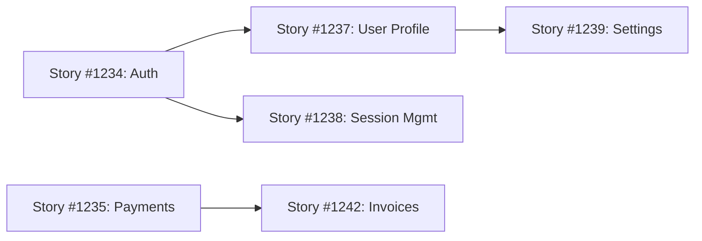

# Sprint Planning

## Current Sprint Overview

### Sprint Information
- **Sprint Number**: Sprint XX
- **Duration**: [Start Date] - [End Date]
- **Sprint Goal**: _Clear, measurable objective for this sprint_
- **Theme**: _Optional theme or focus area_

---

## Sprint Commitment

### Capacity Summary
| Team | Available Hours | Committed Story Points | Reserved (Bug/Tech Debt) |
|------|----------------|------------------------|--------------------------|
| Team Alpha | 280 hrs | 34 SP | 10% (28 hrs) |
| Team Beta | 240 hrs | 28 SP | 15% (36 hrs) |
| Team Gamma | 200 hrs | 25 SP | 20% (40 hrs) |
| **Total** | **720 hrs** | **87 SP** | **104 hrs** |

_See [Capacity Planning](/Capacity-Planning) for detailed team availability_

---

## Sprint Backlog

### Priority 1: Must Have (Critical Path)
| Work Item | Type | Assigned To | Story Points | Status |
|-----------|------|-------------|--------------|--------|
| [ID #1234] Implement user authentication | User Story | Team Alpha | 8 | 🟡 In Progress |
| [ID #1235] API integration for payments | User Story | Team Beta | 13 | 🔵 To Do |
| [ID #1236] Database migration script | Task | Team Gamma | 5 | ✅ Done |

### Priority 2: Should Have (High Value)
| Work Item | Type | Assigned To | Story Points | Status |
|-----------|------|-------------|--------------|--------|
| [ID #1240] Enhanced error logging | User Story | Team Beta | 5 | 🟡 In Progress |
| [ID #1241] Performance optimization | Task | Team Gamma | 3 | 🔵 To Do |

### Priority 3: Nice to Have (Stretch Goals)
| Work Item | Type | Assigned To | Story Points | Status |
|-----------|------|-------------|--------------|--------|
| [ID #1250] UI polish for dashboard | User Story | Team Alpha | 3 | 🔵 To Do |
| [ID #1251] Additional test coverage | Task | All Teams | 5 | 🔵 To Do |

### Technical Debt & Bugs (Reserved Capacity)
| Work Item | Type | Priority | Assigned To | Estimated Hours |
|-----------|------|----------|-------------|-----------------|
| [ID #1260] Fix memory leak in service | Bug | P1 | Team Beta | 8 hrs |
| [ID #1261] Refactor legacy authentication | Tech Debt | Medium | Team Alpha | 16 hrs |
| [ID #1262] Update deprecated dependencies | Tech Debt | Low | Team Gamma | 12 hrs |

---

## Sprint Goals & Success Criteria

### Primary Goal
**Goal**: Complete user authentication flow with OAuth2 integration

**Success Criteria**:
- ✅ User can register with email/password
- ✅ User can login with Google OAuth
- ✅ User can reset password via email
- ✅ Session management implemented
- ✅ Unit tests achieve > 80% coverage
- ✅ Security review passed

### Secondary Goals
1. **Performance**: Reduce API response time by 20%
2. **Quality**: Zero P1/P2 bugs escaping to production
3. **Documentation**: All API endpoints documented in Swagger

---

## Sprint Planning Meeting Notes

### Planning Session Details
- **Date**: [Meeting Date]
- **Duration**: 2 hours
- **Facilitator**: [Delivery Lead Name]
- **Attendees**: All team members, Product Owner, Scrum Masters

### Key Decisions
1. **Decision**: Postpone feature X to next sprint due to dependency
   - **Rationale**: Waiting on vendor API access
   - **Impact**: Adjusted sprint goal to focus on internal features

2. **Decision**: Allocate 20% capacity to tech debt this sprint
   - **Rationale**: Technical debt is slowing velocity
   - **Impact**: Reduced feature work but improved code quality

3. **Decision**: Implement pair programming for complex stories
   - **Rationale**: Knowledge sharing and quality improvement
   - **Impact**: Slower initial progress but better code reviews

### Risks Identified
| Risk | Impact | Mitigation | Owner |
|------|--------|------------|-------|
| Key developer on vacation | High | Cross-train backup, pair programming | Team Lead |
| External API changes | Medium | Mock API for testing, contingency plan | Architect |
| Unclear requirements for Story #1235 | High | Schedule refinement session with PO | Product Owner |

---

## Dependencies & Blockers

### Current Blockers
1. **🚫 BLOCKER**: Waiting for security review approval
   - **Impact**: Cannot deploy to staging
   - **Action**: Follow up with security team daily
   - **Owner**: [Name]
   - **Target Resolution**: [Date]

2. **🚫 BLOCKER**: Production database access not granted
   - **Impact**: Cannot test migration script
   - **Action**: IT ticket #12345 escalated
   - **Owner**: [Name]
   - **Target Resolution**: [Date]

### Sprint Dependencies

### External Dependencies
- **Vendor A**: API credentials (expected by Day 3)
- **Team X**: Shared component release (expected mid-sprint)
- **Infrastructure**: New server provisioning (completed ✅)

---

## Sprint Ceremonies Schedule

### Daily Standup
- **Time**: 9:00 AM daily
- **Duration**: 15 minutes per team
- **Format**: What I did yesterday / What I'll do today / Any blockers
- **Location**: Teams call + optional in-person

### Mid-Sprint Check-in
- **Date**: [Mid-sprint date]
- **Time**: 2:00 PM
- **Purpose**: Review progress, adjust priorities if needed
- **Attendees**: Delivery Lead, Team Leads, Product Owner

### Sprint Review (Demo)
- **Date**: [Last day of sprint]
- **Time**: 2:00 PM
- **Duration**: 1 hour
- **Audience**: Stakeholders, leadership, all teams
- **Format**: Live demos of completed work

### Sprint Retrospective
- **Date**: [Last day of sprint]
- **Time**: 3:30 PM
- **Duration**: 1 hour
- **Attendees**: Development team only
- **Focus**: What went well, what to improve, action items

---

## Progress Tracking

### Sprint Burndown Chart
_Azure DevOps automatically generates burndown charts. View live data:_
- [Team Alpha Burndown](link-to-chart)
- [Team Beta Burndown](link-to-chart)
- [Team Gamma Burndown](link-to-chart)
- [Program-level Burndown](link-to-chart)

### Daily Progress Updates

#### Day 1 - [Date]
- ✅ Sprint planning completed
- ✅ All work items assigned
- 🟡 1 blocker identified (security review)

#### Day 2 - [Date]
- ✅ 3 story points completed
- 🟡 Blocker still active
- ⚠️ New risk: Developer out sick

#### Day 3 - [Date]
- ✅ 8 story points completed
- ✅ Blocker resolved!
- ✅ Team velocity on track

_[Continue daily updates throughout sprint]_

---

## Velocity & Forecasting

### Historical Velocity
| Sprint | Planned SP | Completed SP | Velocity | Team Satisfaction |
|--------|-----------|--------------|----------|-------------------|
| Sprint 15 | 85 | 78 | 92% | 7.5/10 |
| Sprint 16 | 90 | 85 | 94% | 8.0/10 |
| Sprint 17 | 87 | 82 | 94% | 7.8/10 |
| **Current** | **87** | **TBD** | **TBD** | **TBD** |

### Rolling Average
- **3-sprint average**: 81.7 SP
- **Trend**: ↗️ Increasing
- **Confidence**: High (consistent delivery)

### Next Sprint Forecast
Based on current velocity and capacity planning:
- **Projected capacity**: 85-90 story points
- **Risk adjustment**: -5% (holiday period approaching)
- **Recommended commitment**: 80-85 SP

---

## Sprint Retrospective Actions

### Actions from Previous Sprint
| Action Item | Owner | Status | Notes |
|-------------|-------|--------|-------|
| Improve test automation coverage | Team Beta | ✅ Done | Coverage increased to 75% |
| Reduce meeting time by 20% | Delivery Lead | 🟡 In Progress | Optimized standup format |
| Document API endpoints | Team Alpha | ❌ Missed | Carried to current sprint |

### This Sprint's Focus Areas
1. **Process improvement**: Reduce time in code review
2. **Quality**: Zero regression bugs
3. **Team health**: Better work-life balance during crunch periods

---

## Definition of Done (DoD)

### Story-Level DoD
- [ ] All acceptance criteria met
- [ ] Code reviewed and approved by 2+ team members
- [ ] Unit tests written (>80% coverage for new code)
- [ ] Integration tests pass
- [ ] Documentation updated (code comments, wiki, API docs)
- [ ] No P1/P2 bugs found in testing
- [ ] Security scan passed (no critical/high vulnerabilities)
- [ ] Deployed to staging environment
- [ ] Product Owner approval received

### Sprint-Level DoD
- [ ] All committed stories meet DoD
- [ ] Sprint goal achieved
- [ ] No known critical bugs
- [ ] Code merged to main branch
- [ ] Release notes prepared
- [ ] Demo completed successfully

---

## Quick Links

### Azure DevOps Queries
- [Sprint Backlog Query](link-to-query)
- [Active Bugs](link-to-query)
- [Tech Debt Items](link-to-query)
- [Current Sprint Board](link-to-board)

### Related Pages
- 📊 [Program Overview](/Program-Overview)
- 👥 [Capacity Planning](/Capacity-Planning)
- 🗺️ [Product Roadmap](/Roadmap)
- 🎯 [RAID Log](/Risks-Issues)
- 🔄 [Retrospective Insights](/Retrospectives)
- 📈 [Metrics Dashboard](/Metrics-Dashboard)

---

## Tips for Successful Sprint Planning

### Before Planning
- ✅ Backlog refined and estimated
- ✅ Dependencies identified
- ✅ Team capacity calculated
- ✅ Previous sprint retrospective completed
- ✅ Product Owner has prioritized backlog

### During Planning
- 🎯 Clear sprint goal articulated
- 🤝 Team commits collaboratively (not assigned top-down)
- ⚖️ Balance features, bugs, and tech debt
- 🔍 Break down large stories into tasks
- 📝 Document assumptions and dependencies

### After Planning
- 📊 Update Azure DevOps boards
- 📧 Send sprint summary to stakeholders
- 🎬 Kick off work with team standup
- 📅 Schedule mid-sprint check-in

---

## 📚 References

### Sprint Planning Best Practices
- [Scrum Guide - Sprint Planning](https://scrumguides.org/scrum-guide.html#sprint-planning)
- [Azure DevOps Sprint Planning](https://learn.microsoft.com/en-us/azure/devops/boards/sprints/assign-work-sprint)
- [Atlassian: Sprint Planning Guide](https://www.atlassian.com/agile/scrum/sprint-planning)

### Agile Estimation
- [Story Points vs Hours](https://www.mountaingoatsoftware.com/blog/story-points-are-still-about-effort)
- [Planning Poker Technique](https://www.planningpoker.com/)
- [Velocity Tracking](https://learn.microsoft.com/en-us/azure/devops/report/dashboards/team-velocity)

### Tools
- [Azure Boards Sprint Features](https://learn.microsoft.com/en-us/azure/devops/boards/sprints/)
- [Burndown Charts](https://learn.microsoft.com/en-us/azure/devops/report/dashboards/configure-sprint-burndown)
