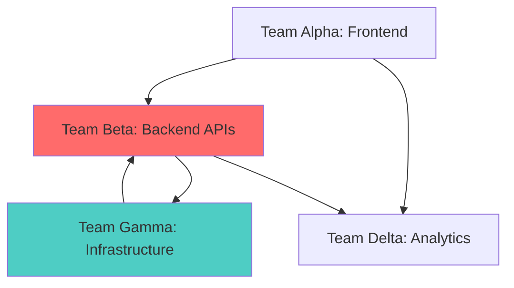

# RAID Log (Risks, Assumptions, Issues, Dependencies)

## Overview

The RAID log is a project management tool for tracking Risks, Assumptions, Issues, and Dependencies. This living document is updated weekly and reviewed in program sync meetings.

**Last Updated**: [Date]  
**Next Review**: [Date]

---

## 🔴 Risks

### Active Risks

| ID | Risk Description | Category | Probability | Impact | Severity | Mitigation Strategy | Owner | Status |
|----|------------------|----------|-------------|--------|----------|---------------------|-------|--------|
| R-001 | Key developer departure during critical phase | People | Medium | High | 🔴 Critical | Cross-training, documentation, retention bonuses | PM | Open |
| R-002 | Third-party API changes breaking integration | Technical | High | Medium | 🟡 High | Mock APIs, version pinning, vendor communication | Arch | Open |
| R-003 | Cloud cost overrun by 30% | Financial | Medium | High | 🔴 Critical | Cost monitoring alerts, usage optimization | DevOps | Open |
| R-004 | Security vulnerability in dependency | Technical | Low | Critical | 🟡 High | Automated scanning, update policy | Security | Open |
| R-005 | Regulatory compliance deadline missed | Compliance | Low | Critical | 🟡 High | Legal review accelerated, compliance checklist | PM | Open |

### Risk Severity Matrix
```
Impact →     Low    Medium    High    Critical
Probability ↓
High         🟢     🟡       🔴      🔴
Medium       🟢     🟡       🟡      🔴
Low          🟢     🟢       🟡      🟡
Rare         🟢     🟢       🟢      🟡
```

### Closed/Resolved Risks
| ID | Risk Description | Resolution | Date Closed |
|----|------------------|------------|-------------|
| R-006 | Database migration failure | Successfully completed with rollback plan tested | Jan 15, 2025 |
| R-007 | Insufficient test coverage | Automated testing implemented, coverage at 85% | Jan 10, 2025 |

---

## Risk Details

### R-001: Key Developer Departure
**Description**: Senior developer on Team Beta may leave during Q2, impacting payment integration epic.

**Probability**: Medium (40%)  
**Impact**: High - Could delay payment features by 4-6 weeks  
**Risk Score**: 8/10 (Critical)

**Mitigation Strategies**:
1. **Prevention**:
   - Conduct retention conversation with developer
   - Review compensation and career growth opportunities
   - Improve work-life balance initiatives

2. **Contingency**:
   - Cross-train two developers on payment integration
   - Complete comprehensive documentation by Mar 1
   - Identify external contractor as backup resource
   - Create knowledge transfer plan (2-week overlap if departure occurs)

**Monitoring**:
- Weekly 1-on-1s with developer
- Track code contribution patterns
- Monitor team morale surveys

**Owner**: Program Manager  
**Review Date**: Weekly

---

### R-002: Third-Party API Changes
**Description**: External APIs (Stripe, SendGrid, Twilio) may introduce breaking changes.

**Probability**: High (60%)  
**Impact**: Medium - 1-2 weeks to adapt  
**Risk Score**: 7/10 (High)

**Mitigation Strategies**:
1. **Prevention**:
   - Subscribe to all vendor API changelogs
   - Pin API versions in production
   - Maintain mock servers for testing
   - Implement adapter pattern for API integrations

2. **Contingency**:
   - Automated integration tests run daily
   - Alerts for API response changes
   - Fallback mechanisms for non-critical integrations
   - Vendor escalation contacts documented

**Owner**: Technical Architect  
**Review Date**: Bi-weekly

---

### R-003: Cloud Cost Overrun
**Description**: Current trajectory shows 30% budget overrun by Q3.

**Probability**: Medium (50%)  
**Impact**: High - $50K over budget  
**Risk Score**: 8/10 (Critical)

**Mitigation Strategies**:
1. **Prevention**:
   - Implement cost allocation tags on all resources
   - Set up CloudWatch billing alarms (weekly review)
   - Right-size instances based on actual usage
   - Implement auto-scaling policies
   - Review data transfer costs (largest expense)

2. **Contingency**:
   - Secure budget approval for overrun if needed
   - Identify non-critical services to scale down
   - Evaluate reserved instance pricing
   - Consider multi-cloud cost optimization

**Current Actions**:
- ✅ Cost dashboard created
- 🟡 Instance optimization in progress (est. 15% savings)
- 🔵 Reserved instance analysis scheduled for Feb 15

**Owner**: DevOps Lead  
**Review Date**: Weekly

---

## 📋 Assumptions

### Active Assumptions

| ID | Assumption | Validation Status | Risk if Wrong | Owner |
|----|------------|-------------------|---------------|-------|
| A-001 | Users will adopt OAuth2 over traditional login (80%+ adoption) | 🟡 Partially validated (beta: 65%) | Medium - may need to support both | PO |
| A-002 | Average user session duration will be 15-20 minutes | 🔵 Not validated yet | Low - affects caching strategy | Architect |
| A-003 | Payment processing will be <5% of transactions initially | 🟢 Validated (beta: 3%) | Medium - infrastructure sizing | DevOps |
| A-004 | Users will primarily access from desktop (70/30 split) | 🔴 Invalidated (beta: 55/45) | High - mobile prioritization needed | PO |
| A-005 | Third-party integrations needed for only 20% of users | 🟡 Partially validated | Medium - development effort | PM |

### Assumption Validation Process
1. **Identify** assumption during planning
2. **Document** in RAID log with validation criteria
3. **Test** through beta program or market research
4. **Review** results against criteria
5. **Adjust** plans if assumption proves incorrect

---

## 🔥 Issues

### Critical Issues (P1)
| ID | Issue Description | Opened | Impact | Assigned To | Target Resolution | Status |
|----|------------------|--------|--------|-------------|-------------------|--------|
| I-001 | Production database query timeout affecting 10% of users | Jan 20 | Critical | DevOps + DBA | Jan 22 | 🟡 In Progress |
| I-002 | Payment processing failures in EU region | Jan 21 | Critical | Team Beta | Jan 23 | 🟡 In Progress |

### High Priority Issues (P2)
| ID | Issue Description | Opened | Impact | Assigned To | Target Resolution | Status |
|----|------------------|--------|--------|-------------|-------------------|--------|
| I-003 | Mobile app crash on iOS 16 devices | Jan 18 | High | Team Alpha | Jan 28 | 🟡 In Progress |
| I-004 | Dashboard load time > 5 seconds for large datasets | Jan 19 | High | Team Delta | Feb 5 | 🔵 To Do |
| I-005 | Intermittent SSO failures with Microsoft | Jan 20 | High | Team Beta | Jan 30 | 🟡 In Progress |

### Medium Priority Issues (P3)
| ID | Issue Description | Opened | Impact | Assigned To | Target Resolution | Status |
|----|------------------|--------|--------|-------------|-------------------|--------|
| I-006 | Email notifications delayed by 2-3 hours | Jan 17 | Medium | Team Gamma | Feb 10 | 🔵 To Do |
| I-007 | Inconsistent UI spacing on Firefox | Jan 19 | Medium | Team Alpha | Feb 15 | 🔵 To Do |

### Recently Resolved Issues
| ID | Issue Description | Resolution | Date Closed |
|----|------------------|------------|-------------|
| I-008 | API rate limiting causing 429 errors | Implemented exponential backoff | Jan 18, 2025 |
| I-009 | Memory leak in background job processor | Fixed connection pool management | Jan 15, 2025 |

---

## Issue Escalation Process

### Severity Definitions
- **P1 (Critical)**: System down, data loss, security breach → Immediate response
- **P2 (High)**: Major feature broken, significant user impact → 4-hour response
- **P3 (Medium)**: Minor feature issues, workaround available → 24-hour response
- **P4 (Low)**: Cosmetic issues, enhancement requests → Next sprint

### Escalation Path
1. **L1**: Team identifies issue → Self-resolve within 2 hours
2. **L2**: Team Lead escalation → Cross-team support, 4-hour resolution target
3. **L3**: Delivery Lead escalation → Management involvement, all-hands-on-deck
4. **L4**: Program Manager escalation → Executive notification, vendor engagement

---

## 🔗 Dependencies

### External Dependencies

| ID | Dependency Description | Provider | Criticality | Expected Date | Status | Blocker? |
|----|------------------------|----------|-------------|---------------|--------|----------|
| D-001 | Stripe merchant account approval | Stripe | Critical | Feb 5, 2025 | 🟡 Pending | Yes |
| D-002 | AWS EC2 quota increase (100 → 500 instances) | AWS | High | Feb 10, 2025 | 🟡 Requested | No |
| D-003 | Legal review of Terms of Service | Legal Dept | Critical | Mar 1, 2025 | 🔵 Scheduled | No |
| D-004 | Security audit completion | Third-party auditor | High | Mar 15, 2025 | 🟢 On Track | No |
| D-005 | Design system from UX team | Design Team | Medium | Feb 20, 2025 | 🟢 On Track | No |

### Internal Dependencies

| ID | Dependency Description | Depends On | Required By | Criticality | Status | Blocker? |
|----|------------------------|------------|-------------|-------------|--------|----------|
| D-006 | Payment integration | Authentication (Team Alpha) | Team Beta | Critical | 🟢 Ready | No |
| D-007 | User profile features | Database migration (Team Gamma) | Team Alpha | High | 🟡 In Progress | Yes |
| D-008 | Analytics dashboard | Data pipeline (Team Delta) | Product Mgmt | Medium | 🟢 Ready | No |
| D-009 | Mobile API endpoints | Backend services (Team Beta) | Team Alpha | Critical | 🟡 In Progress | No |

### Cross-Team Dependencies (Current Sprint)


---

## Dependency Management

### Preventing Dependency Issues
1. **Early identification**: Capture dependencies during sprint planning
2. **Clear communication**: Daily syncs between dependent teams
3. **Buffer time**: Add 20% buffer for inter-team dependencies
4. **Documentation**: API contracts documented before implementation
5. **Integration testing**: Test integrations frequently, not just at end

### When Dependencies Become Blockers
1. **Immediate escalation**: Notify Delivery Lead within 2 hours
2. **Daily status updates**: Until resolved
3. **Workarounds**: Identify temporary solutions (mocks, stubs)
4. **Replanning**: Adjust sprint commitments if needed
5. **Retrospective**: Learn and improve process

---

## RAID Log Maintenance

### Update Frequency
- **Risks**: Weekly review, add new risks as identified
- **Assumptions**: Validate throughout beta program, update status
- **Issues**: Real-time updates as issues arise/resolve
- **Dependencies**: Daily review during active dependencies

### Review Meetings
- **Weekly Program Sync**: Review top 5 risks, critical issues, blockers
- **Monthly Steering Committee**: High-level risk trends, major issues
- **Sprint Planning**: Review dependencies for upcoming sprint
- **Retrospectives**: Identify new risks from past issues

### Ownership
- **Program Manager**: Overall RAID log maintenance
- **Delivery Lead**: Issue tracking and escalation
- **Technical Architect**: Technical risk assessment
- **Team Leads**: Input risks, issues, dependencies from teams

---

## Metrics & Trends

### Risk Metrics
- **Total active risks**: 5
- **Critical risks**: 2 (40%)
- **High risks**: 2 (40%)
- **Trend**: Increasing (3 → 5 in last month)

### Issue Metrics
- **Open issues**: 7
- **P1 issues**: 2 (28%)
- **Average resolution time**:
  - P1: 18 hours (target: 24 hours) ✅
  - P2: 4.5 days (target: 3 days) ⚠️
  - P3: 12 days (target: 10 days) ⚠️

### Dependency Metrics
- **Total dependencies**: 11
- **Blockers**: 2 (18%)
- **External dependencies**: 5 (45%)
- **On-time delivery rate**: 73% (target: 85%)

---

## Quick Links

### Related Pages
- 📊 [Program Overview](/Program-Overview)
- 📅 [Sprint Planning](/Sprint-Planning)
- 🗺️ [Product Roadmap](/Roadmap)
- 📈 [Metrics Dashboard](/Metrics-Dashboard)
- 🔄 [Retrospective Insights](/Retrospectives)

### Azure DevOps
- [Issues Query](link-to-issues)
- [Blocked Items Query](link-to-blockers)
- [Bug Board](link-to-bugs)

---

## 📚 References

### Risk Management
- [PMI Risk Management Guide](https://www.pmi.org/learning/library/risk-management-plan-example-8424)
- [RAID Log Best Practices](https://www.projectmanager.com/blog/raid-log)
- [Risk Assessment Frameworks](https://www.isaca.org/resources/isaca-journal/issues/2021/volume-5/risk-assessment-frameworks)

### Issue Management
- [Incident Management Best Practices](https://www.atlassian.com/incident-management/handbook/incident-management-process)
- [Azure DevOps Issue Tracking](https://learn.microsoft.com/en-us/azure/devops/boards/backlogs/manage-bugs)

### Dependency Management
- [Managing Dependencies at Scale](https://www.scaledagileframework.com/program-increment/)
- [Cross-Team Coordination](https://www.scruminc.com/scaling-scrum-managing-dependencies/)
