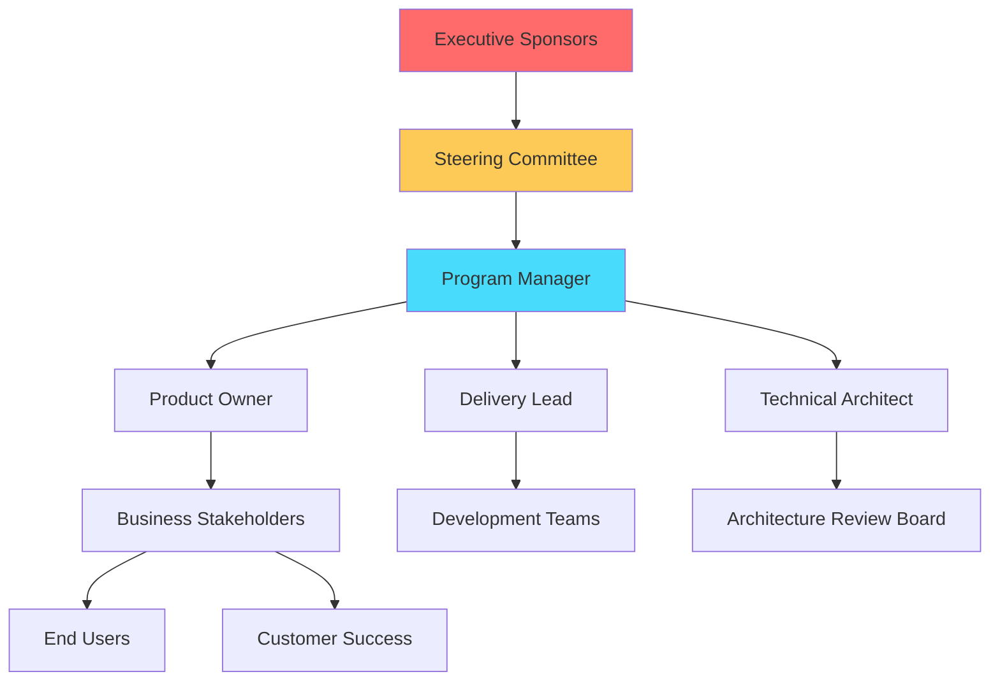

# Stakeholder Communications

## Communication Strategy

### Purpose
This page defines how we communicate with stakeholders, ensuring transparency, alignment, and timely information flow across the program.

### Stakeholder Map


---

## Stakeholder Registry

### Executive Level

| Name | Role | Interest | Influence | Communication Preference | Frequency |
|------|------|----------|-----------|-------------------------|-----------|
| Jane Smith | CTO | High | High | Email summary + monthly meeting | Monthly |
| John Doe | VP Engineering | High | High | Weekly status + Slack | Weekly |
| Sarah Johnson | CFO | Medium | High | Quarterly business review | Quarterly |

### Program Level

| Name | Role | Interest | Influence | Communication Preference | Frequency |
|------|------|----------|-----------|-------------------------|-----------|
| [Your Name] | Program Manager | High | High | All channels | Daily |
| Alex Chen | Product Owner | High | High | Daily standup + Teams | Daily |
| Maria Garcia | Delivery Lead | High | Medium | Sprint ceremonies + Slack | Daily |
| David Kim | Tech Architect | High | Medium | Design reviews + email | Weekly |

### Business Stakeholders

| Name | Role | Interest | Influence | Communication Preference | Frequency |
|------|------|----------|-----------|-------------------------|-----------|
| Lisa Brown | VP Sales | High | Medium | Demo sessions + email | Bi-weekly |
| Tom Wilson | VP Marketing | Medium | Medium | Monthly update | Monthly |
| Emma Taylor | Customer Success Lead | High | Low | Weekly sync | Weekly |

### External Stakeholders

| Name | Role | Interest | Influence | Communication Preference | Frequency |
|------|------|----------|-----------|-------------------------|-----------|
| Beta User Group | Early Adopters | High | Low | Email newsletter + Slack community | Weekly |
| Compliance Officer | Regulatory | Medium | High | Compliance reports | Quarterly |
| Vendor Partners | Third-party providers | Medium | Medium | Email + quarterly review | Quarterly |

---

## Communication Channels

### Synchronous Communication

#### 1. Executive Steering Committee
- **Frequency**: Monthly (first Tuesday, 10:00 AM)
- **Duration**: 90 minutes
- **Attendees**: Executives, Program Manager, Product Owner
- **Purpose**: Strategic decisions, budget review, major milestone approval
- **Format**: 
  - 15 min: Status dashboard review
  - 30 min: Key decisions needed
  - 30 min: Risk/issue discussion
  - 15 min: Next month preview

#### 2. Program Sync Meeting
- **Frequency**: Weekly (Monday, 9:00 AM)
- **Duration**: 60 minutes
- **Attendees**: Program leadership team
- **Purpose**: Tactical coordination, blocker resolution
- **Agenda**:
  - Sprint progress review (15 min)
  - Risks & issues (20 min)
  - Dependencies & blockers (15 min)
  - Next week preview (10 min)

#### 3. Stakeholder Demo Day
- **Frequency**: Bi-weekly (end of sprint)
- **Duration**: 60 minutes
- **Attendees**: All stakeholders invited (50-100 people)
- **Purpose**: Show working software, gather feedback
- **Format**:
  - Team demos (40 min)
  - Q&A (15 min)
  - Upcoming work preview (5 min)

#### 4. All-Hands Meeting
- **Frequency**: Monthly (last Friday, 2:00 PM)
- **Duration**: 45 minutes
- **Attendees**: Entire program (all teams)
- **Purpose**: Alignment, celebration, transparency
- **Agenda**:
  - Program metrics & milestones (10 min)
  - Team spotlights (15 min)
  - Q&A (15 min)
  - Celebrations & recognition (5 min)

#### 5. Customer Advisory Board
- **Frequency**: Quarterly
- **Duration**: 2 hours
- **Attendees**: Key customers, Product Owner, PM
- **Purpose**: Product feedback, roadmap input, relationship building

---

### Asynchronous Communication

#### 1. Weekly Status Report
**Audience**: Executives, steering committee  
**Delivery**: Every Friday by 3 PM via email  
**Format**: [See template below](#weekly-status-report-template)

#### 2. Sprint Summary
**Audience**: All stakeholders  
**Delivery**: End of every sprint via email + wiki update  
**Format**: [See template below](#sprint-summary-template)

#### 3. Monthly Newsletter
**Audience**: Extended stakeholders, beta users  
**Delivery**: First Monday of each month  
**Format**: 
- Program highlights
- Feature releases
- Upcoming events
- Team spotlights
- Success stories

#### 4. Quarterly Business Review
**Audience**: Executive team, board of directors  
**Delivery**: Within 2 weeks of quarter end  
**Format**: [See template below](#quarterly-business-review-template)

#### 5. Release Notes
**Audience**: All users, customer success team  
**Delivery**: With every production release  
**Format**:
- New features
- Bug fixes
- Known issues
- Migration guide (if needed)

---

## Communication Templates

### Weekly Status Report Template

```markdown
Subject: [Program Name] - Weekly Status Report - [Date]

Executive Summary:
[2-3 sentences on overall status: Green/Yellow/Red]

Key Accomplishments This Week:
✅ [Accomplishment 1]
✅ [Accomplishment 2]
✅ [Accomplishment 3]

Planned for Next Week:
📅 [Planned item 1]
📅 [Planned item 2]
📅 [Planned item 3]

Top 3 Risks/Issues:
🔴 [Critical issue/risk] - [Mitigation plan]
🟡 [High risk] - [Status update]
🟢 [Medium issue] - [Tracking]

Metrics:
- Sprint Velocity: 87 SP (target: 85 SP) ✅
- Defect Count: 12 (target: <15) ✅
- Test Coverage: 82% (target: >80%) ✅
- Team Satisfaction: 7.8/10 (target: >7.5) ✅

Decisions Needed:
❓ [Decision 1] - [Context and options]

Budget Status:
💰 $450K spent of $600K budget (75% - on track)

Timeline Status:
📅 Milestone 1: Complete ✅
📅 Milestone 2: On track for Feb 28 🟢
📅 Milestone 3: At risk - 1 week delay 🟡

Attachments:
- Sprint burndown chart
- Velocity trend
```

---

### Sprint Summary Template

```markdown
Subject: Sprint [Number] Summary - [Sprint Name/Goal]

Sprint Goal: [Clear statement of what was planned]
Status: ✅ Goal Achieved / 🟡 Partially Achieved / ❌ Not Achieved

Highlights:
✨ [Major feature completed]
✨ [Significant improvement]
✨ [Team achievement]

Delivered Features:
- [Feature 1]: [Brief description] - [Link to demo/docs]
- [Feature 2]: [Brief description] - [Link to demo/docs]
- [Feature 3]: [Brief description] - [Link to demo/docs]

Metrics:
- Committed: 87 story points
- Completed: 82 story points (94% completion)
- Velocity: 3-sprint average = 81.7 SP

Quality:
- Bugs found: 3 (2 fixed, 1 in progress)
- Test coverage: 85% (+3% from last sprint)
- Code review cycle time: 4.2 hours (target: <6 hours)

Team Health:
- Team satisfaction: 8.2/10
- Sprint retrospective rating: 4.5/5
- Key improvement action: [Action item]

Next Sprint Preview:
🎯 Sprint Goal: [Next sprint goal]
📅 Dates: [Start] - [End]
🚀 Major focus areas:
   - [Focus area 1]
   - [Focus area 2]
   - [Focus area 3]

View full sprint details: [Link to Sprint Planning page]
```

---

### Quarterly Business Review Template

```markdown
# Q[X] 20XX Business Review
[Program Name]

## Executive Summary
[1-page overview of quarter performance]

## Objectives Review
[Review OKRs set for the quarter]

| Objective | Target | Actual | Status |
|-----------|--------|--------|--------|
| [Objective 1] | [Target] | [Actual] | ✅/🟡/❌ |

## Key Achievements
1. [Major achievement 1]
2. [Major achievement 2]
3. [Major achievement 3]

## Metrics Dashboard
[Include charts/graphs]
- User growth
- Feature adoption
- System performance
- Team velocity
- Quality metrics
- Budget vs. actuals

## Challenges & Learnings
[What went wrong and what we learned]

## Next Quarter Priorities
[Top 3-5 priorities for next quarter]

## Financial Summary
- Budget: $X allocated, $Y spent (Z% utilization)
- ROI: [If applicable]
- Cost per feature: [Calculated metric]

## Team Health
- Headcount: Started with X, ended with Y
- Attrition: Z%
- Team satisfaction: Score/trend
- Training hours: Total hours invested

## Appendix
- Detailed metrics
- Risk register
- Dependency analysis
```

---

## Communication Principles

### Transparency
- **Default to open**: Share information by default unless sensitive
- **Bad news travels fast**: Communicate issues immediately
- **No surprises**: Stakeholders should never be blindsided
- **Show your work**: Explain decisions and rationale

### Clarity
- **Use plain language**: Avoid jargon with business stakeholders
- **Be specific**: Use numbers, dates, concrete examples
- **Highlight what matters**: Lead with conclusions, not details
- **Visual aids**: Use charts, diagrams, screenshots

### Timeliness
- **Proactive updates**: Don't wait to be asked
- **Consistent cadence**: Stick to communication schedule
- **Real-time for critical issues**: Phone/Teams for P1 incidents
- **Summary within 24 hours**: After major events (incidents, releases)

### Audience Awareness
- **Executives**: Focus on impact, decisions, escalations (1-page summary)
- **Stakeholders**: Balance of progress and blockers (2-3 pages)
- **Teams**: Detailed technical information, context
- **Users**: Features, benefits, how-to guides

---

## Communication Matrix

| What | Who (Audience) | How (Channel) | When (Frequency) | Owner |
|------|---------------|---------------|------------------|-------|
| Strategic decisions | Steering Committee | Meeting + email | Monthly | PM |
| Sprint progress | Program leadership | Meeting + wiki | Weekly | Delivery Lead |
| Demos | All stakeholders | Live demo + recording | Bi-weekly | Teams |
| Status summary | Executives | Email report | Weekly | PM |
| Detailed metrics | Leadership team | Dashboard + wiki | Real-time | PM |
| Feature releases | All users | Email + release notes | Per release | PO |
| Incidents | Affected stakeholders | Email + status page | Real-time | On-call eng |
| Roadmap changes | All stakeholders | Email + meeting | As needed | PO |
| Budget updates | Finance + executives | Report + meeting | Monthly | PM |
| Team celebrations | Entire program | Slack + all-hands | Ongoing | All |

---

## Crisis Communication Plan

### Definition of Crisis
- **P1 Production Incident**: System down, data loss, security breach
- **Major Delay**: Milestone slipping by >2 weeks
- **Budget Overrun**: >10% over approved budget
- **Key Person Departure**: Critical role, short notice
- **Regulatory Issue**: Compliance violation, audit finding

### Crisis Communication Protocol

#### Phase 1: Initial Response (First 30 minutes)
1. **Assess situation**: Confirm facts, impact, severity
2. **Notify core team**: Program Manager, Delivery Lead, relevant Team Lead
3. **Initial stakeholder alert**:
   - Subject: "[URGENT] [Brief description]"
   - Format: "We are aware of [issue]. Team is investigating. Updates every [frequency]."

#### Phase 2: Investigation (First 4 hours)
1. **War room**: Assemble response team
2. **Root cause analysis**: Understand what happened
3. **Regular updates**: Every 30-60 minutes to stakeholders
4. **Mitigation actions**: Implement fixes or workarounds

#### Phase 3: Resolution & Communication (Day 1-3)
1. **Resolution summary**: What was fixed, how
2. **Impact assessment**: Who was affected, for how long
3. **Preventive measures**: What we're doing to prevent recurrence
4. **Post-mortem scheduled**: Within 72 hours

#### Phase 4: Follow-up (Week 1)
1. **Detailed RCA report**: Shared with stakeholders
2. **Action items tracked**: Assigned owners and due dates
3. **Process improvements**: Updated runbooks, alerts, etc.
4. **Stakeholder debrief**: Answer questions, rebuild confidence

---

## Stakeholder Feedback Mechanisms

### Feedback Channels
1. **Direct feedback**: Email, Teams, in-person
2. **Surveys**: Quarterly stakeholder satisfaction survey
3. **Demo Q&A**: Questions during demo sessions
4. **Retrospectives**: Include stakeholder perspective
5. **1-on-1 conversations**: Regular check-ins with key stakeholders

### Survey Questions (Quarterly)
1. How satisfied are you with program communication? (1-10)
2. Do you receive information at the right frequency? (Too much/Just right/Too little)
3. Is the information useful and actionable? (1-10)
4. What communication channel do you prefer?
5. What would you like to hear more about?
6. What would you like to hear less about?
7. Any suggestions for improvement?

### Feedback Analysis
- **Target satisfaction score**: >8/10
- **Current score**: [Track quarterly]
- **Trends**: [Improving/stable/declining]
- **Action items**: Based on feedback themes

---

## Tools & Platforms

### Communication Tools
- **Email**: Formal updates, reports, documentation
- **Microsoft Teams**: Real-time chat, quick questions, team channels
- **Azure DevOps Wiki**: Living documentation (this!)
- **Azure DevOps Dashboards**: Real-time metrics visualization
- **Confluence/SharePoint**: Long-form documentation (if applicable)
- **Slack Community**: External stakeholder engagement (beta users)
- **Status Page**: Public incident communication

### Distribution Lists
- `program-all@example.com`: Entire program team
- `program-leadership@example.com`: Leadership team only
- `stakeholders-exec@example.com`: Executive stakeholders
- `stakeholders-business@example.com`: Business stakeholders
- `beta-users@example.com`: Beta program participants

---

## Communication Calendar

### January 2025
| Date | Event | Audience | Owner |
|------|-------|----------|-------|
| Jan 6 | Weekly status | Executives | PM |
| Jan 7 | Steering Committee | Executives | PM |
| Jan 10 | Sprint 15 demo | All stakeholders | Teams |
| Jan 13 | Weekly status | Executives | PM |
| Jan 20 | Weekly status | Executives | PM |
| Jan 24 | Sprint 16 demo | All stakeholders | Teams |
| Jan 27 | Weekly status | Executives | PM |
| Jan 31 | All-hands meeting | Entire program | PM |

### Recurring Events
- **Every Monday**: Program sync meeting
- **Every Friday**: Weekly status report
- **Every 2 weeks**: Sprint demo
- **First Tuesday**: Steering committee
- **Last Friday**: All-hands meeting
- **First Monday**: Monthly newsletter

---

## Quick Links

### Related Pages
- 📊 [Program Overview](/Program-Overview)
- 📅 [Sprint Planning](/Sprint-Planning)
- 🗺️ [Product Roadmap](/Roadmap)
- 🎯 [RAID Log](/Risks-Issues)
- 📈 [Metrics Dashboard](/Metrics-Dashboard)

### Communication Resources
- [Status Report Archive](link-to-folder)
- [Demo Recordings](link-to-recordings)
- [Presentation Templates](link-to-templates)

---

## 📚 References

### Stakeholder Management
- [PMI Stakeholder Management](https://www.pmi.org/learning/library/stakeholder-management-task-project-success-7736)
- [Stakeholder Communication Plan Template](https://www.projectmanager.com/templates/stakeholder-communication-plan-template)

### Crisis Communication
- [Incident Communication Best Practices](https://www.atlassian.com/incident-management/handbook/incident-communication)
- [How to Write Status Page Updates](https://www.statuspage.io/blog/incident-communication-best-practices)

### Effective Communication
- [The Five C's of Effective Communication](https://www.indeed.com/career-advice/career-development/effective-communication)
- [Executive Communication Strategies](https://hbr.org/2021/03/how-to-communicate-effectively-with-your-boss)
